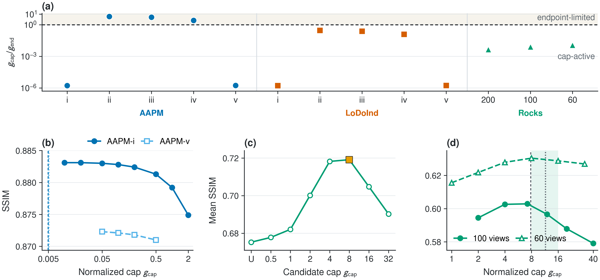
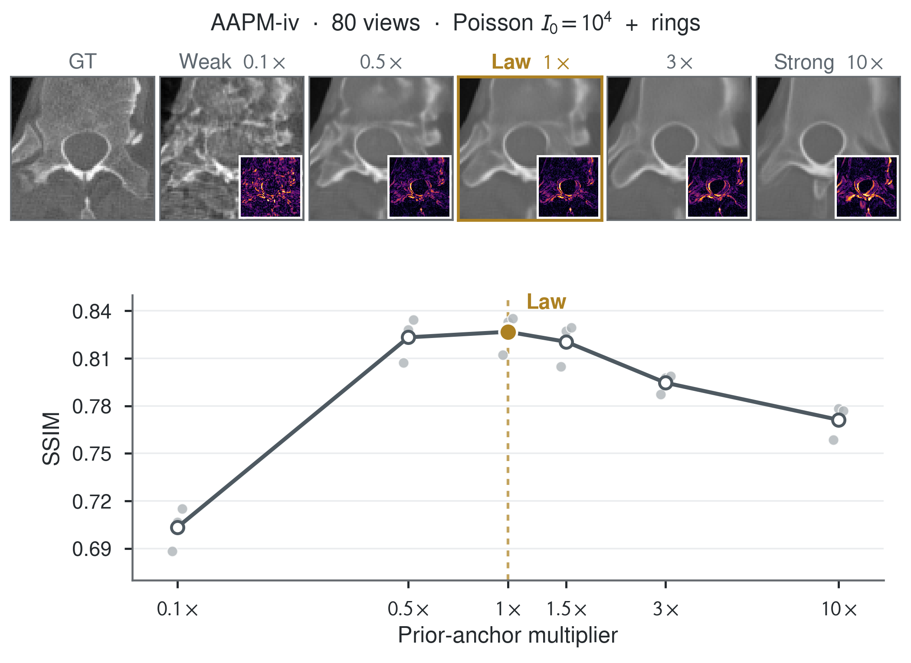
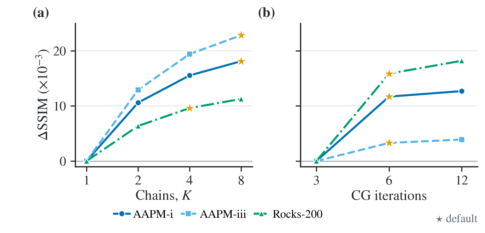

# Robust Zero-Shot Diffusion CT Reconstruction

Official pre-publication code package for:

> **Robust Zero-Shot Diffusion CT Reconstruction via a Closed-Form
> Data-Consistency Law**
> Jia Wu, Qinghai Liu, Xicheng Lou, Zheng Zhang, Xiaojiang Liu, Chao He,
> Weijie Qiu, and Xin Xie

The method adapts the data-consistency trajectory of a zero-shot diffusion CT
reconstructor to the acquisition at hand. After one sampler-level calibration,
the prior-anchor cap is computed from three quantities available before
reconstruction: a sinogram-derived noise proxy, a stored prior-error statistic,
and the response scale of the CT operator. No configuration-specific cap sweep
is performed at test time.

This repository is deliberately smaller than the internal research workspace.
It contains the original method core, protocol-locked parameters, tests, and
host-neutral result summaries. Patient data, industrial data, measured
synchrotron data, pretrained priors, reconstructed images, baseline caches,
logs, and private paper material are not included.

## Method in one view

Let \(\sigma_n^2\) denote the acquisition noise proxy, \(\delta\) the stored
terminal denoising error for the domain prior, and `GAIN` the response of the
forward operator to a fixed-seed Gaussian probe. The normalized cap is

\[
g_{\mathrm{cap}}
=
\frac{c}{\mathrm{GAIN}}
\left(
1+\frac{\sigma_n^2}{\delta^2}
\right).
\]

The paper writes the unit floor in the equivalent form

\[
g_{\mathrm{cap}}
=
\frac{c\,[\sigma_n^2+(\kappa\delta)^2]}
{\delta^2\,\mathrm{GAIN}},
\qquad \kappa=1.
\]

At noise level \(\sigma_t\), the operator-scale proximal weight is

\[
\gamma_t
=
\mathrm{GAIN}
\min\!\left(
\frac{\bar{\gamma}}{\sigma_t^2+\epsilon},
g_{\mathrm{cap}}
\right).
\]

The clean diffusion estimate is then coupled to the measurement by a
warm-started proximal conjugate-gradient update. A separate detector-column
reliability mask removes only columns detected as corrupted. The mask is fixed
throughout the reverse trajectory.

The frozen release uses `c = 0.6268280959341184`, calibrated on five slices from
the independent Rocks F3_1 acquisition. Each image domain uses its own
clean-image diffusion prior; the sampler-level factor is shared.

## What is included

```text
src/robust_ct/                 framework-independent method core
configs/law_f3_1.json          frozen law, schedule, and operating states
configs/paths.example.toml     local data/model path template
results_summary/               host-neutral complete-test statistics
scripts/                       artifact export and validation utilities
tests/                         formula, CG, mask, schedule, and sampler tests
```

The core is expressed through NumPy callables for the forward operator,
adjoint, and denoiser. It can therefore be connected to ASTRA, torch-radon,
tomosipo, or another CT backend without copying a third-party sampler into this
repository.

## Installation

Python 3.10–3.12 is supported for the framework-independent core.

```bash
git clone https://github.com/wujia-xyz/robust-zero-shot-diffusion-ct.git
cd robust-zero-shot-diffusion-ct
python -m venv .venv
source .venv/bin/activate
python -m pip install --upgrade pip
python -m pip install -e ".[test]"
python -m pytest
```

The supplied `environment.yml` provides the equivalent small Conda
environment. A full CT experiment additionally needs the reconstruction
backend and diffusion framework used by the caller.

## Quick numerical check

The following example recomputes the frozen Rocks-60 cap:

```python
from robust_ct import compute_normalized_cap

g_cap = compute_normalized_cap(
    noise_variance=0.227,
    prior_error=0.00806335503350648,
    gain=190.0,
    calibration_factor=0.6268280959341184,
)
print(g_cap)  # 11.521619251499802
```

The exact frozen values for all acquisitions are in
[`configs/law_f3_1.json`](configs/law_f3_1.json).

<p align="center">
  
</p>

## Connecting the law to a diffusion sampler

For each domain, load the corresponding clean-image prior and construct the
domain-specific denoiser. For a new acquisition:

1. Estimate the measurement noise proxy from the sinogram.
2. Reuse the domain's stored terminal prior error \(\delta\).
3. Measure the operator `GAIN` with the fixed-seed probe.
4. compute `g_cap` once, before the reverse process;
5. at every reverse level, cap the annealed proximal weight;
6. apply the warm-started proximal-CG update and continue the standard
   re-noising transition.

In code, the central update has the following structure:

```python
g_cap = compute_normalized_cap(
    noise_variance=sigma_n2,
    prior_error=delta,
    gain=gain,
    calibration_factor=c,
)

gamma_t = gain * min(gamma_bar / (sigma_t**2 + eps), g_cap)
x0_prox = proximal_cg(
    forward=forward,
    adjoint=adjoint,
    measurement=y,
    prior_center=x0_hat,
    prior_weight=gamma_t,
    iterations=6,
    weights=detector_weights,
)
```

The package also provides a callback-based reference sampler. It demonstrates
the complete method without fixing a particular diffusion-model library or CT
operator implementation.

## Data and pretrained priors

The experiments follow the DM4CT data definitions and use the original
domain-specific clean-image priors. Download each resource from its official
host and follow its terms of use.

| Domain | Data | Pixel-space prior |
|---|---|---|
| Medical CT | [AAPM Low Dose CT Grand Challenge](https://www.aapm.org/grandchallenge/lowdosect/) | [jiayangshi/lodochallenge_pixel_diffusion](https://huggingface.co/jiayangshi/lodochallenge_pixel_diffusion) |
| Industrial CT | [LoDoInd](https://zenodo.org/records/10391412) | [jiayangshi/lodoind_pixel_diffusion](https://huggingface.co/jiayangshi/lodoind_pixel_diffusion) |
| Synchrotron CT | [Rocks](https://zenodo.org/records/15420527) | [jiayangshi/synchrotron_pixel_diffusion](https://huggingface.co/jiayangshi/synchrotron_pixel_diffusion) |

The comparison protocol and baseline samplers are provided by
[DM4CT](https://github.com/DM4CT/DM4CT). This repository does not duplicate the
ten comparison samplers.

## Frozen complete-test results

The reported values below are unweighted means over every raw test slice:
526 AAPM slices, 500 LoDoInd slices, and 660 Rocks slices. AAPM and LoDoInd use
an eight-chain image average; Rocks uses four chains.

| Domain | Configuration | Slices | PSNR | SSIM |
|---|---:|---:|---:|---:|
| AAPM | i | 526 | 31.86 | 0.8822 |
| AAPM | ii | 526 | 27.69 | 0.7817 |
| AAPM | iii | 526 | 29.44 | 0.8147 |
| AAPM | iv | 526 | 29.50 | 0.8270 |
| AAPM | v | 526 | 31.21 | 0.8720 |
| LoDoInd | i | 500 | 23.61 | 0.6800 |
| LoDoInd | ii | 500 | 20.15 | 0.5638 |
| LoDoInd | iii | 500 | 23.72 | 0.6956 |
| LoDoInd | iv | 500 | 22.27 | 0.6434 |
| LoDoInd | v | 500 | 21.70 | 0.6369 |
| Rocks | 200 views | 660 | 33.48 | 0.6342 |
| Rocks | 100 views | 660 | 32.68 | 0.5956 |
| Rocks | 60 views | 660 | 32.15 | 0.5733 |

Full-precision means, standard deviations, standard errors, minima, and maxima
are stored in
[`results_summary/full_test_summary.json`](results_summary/full_test_summary.json).
The summary covers 7,110 reconstructed slices.

The repository also retains the host-neutral mechanism and compute-ablation
figures used to audit the frozen protocol:

<p align="center">
  
  
</p>

## Reproducibility boundary

The cap law is closed form **after one sampler-level calibration**. The factor
`c` fixes the absolute mapping between the modal surrogate and the numerical
sampler. It does not determine the relative change between acquisitions:
with `c` fixed, the variation is prescribed by the noise proxy, prior error,
and operator gain.

The repository does not claim to make controlled medical data or third-party
checkpoints freely redistributable. It also does not relabel third-party source
code as part of this method. The current private release therefore keeps the
framework-independent original implementation separate from DM4CT.

## Citation

The paper is under submission. Until bibliographic metadata is final, use the
entry in [`CITATION.cff`](CITATION.cff). A BibTeX entry with the DOI and final
page information will be added after publication.

## License status

This is a private pre-publication release. See
[`LICENSE_PENDING.md`](LICENSE_PENDING.md) and [`NOTICE.md`](NOTICE.md). Select
an explicit software license and complete the third-party notice review before
changing the GitHub repository to public.
